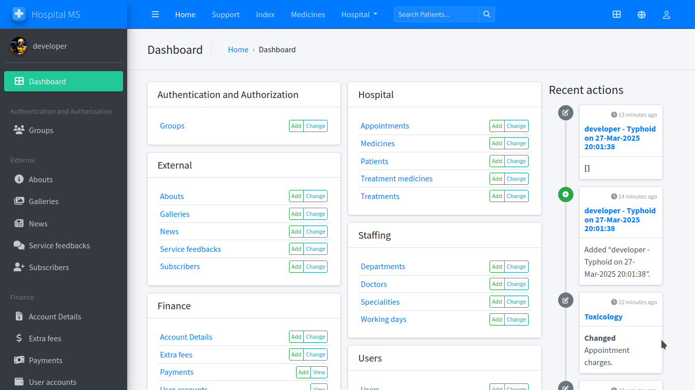
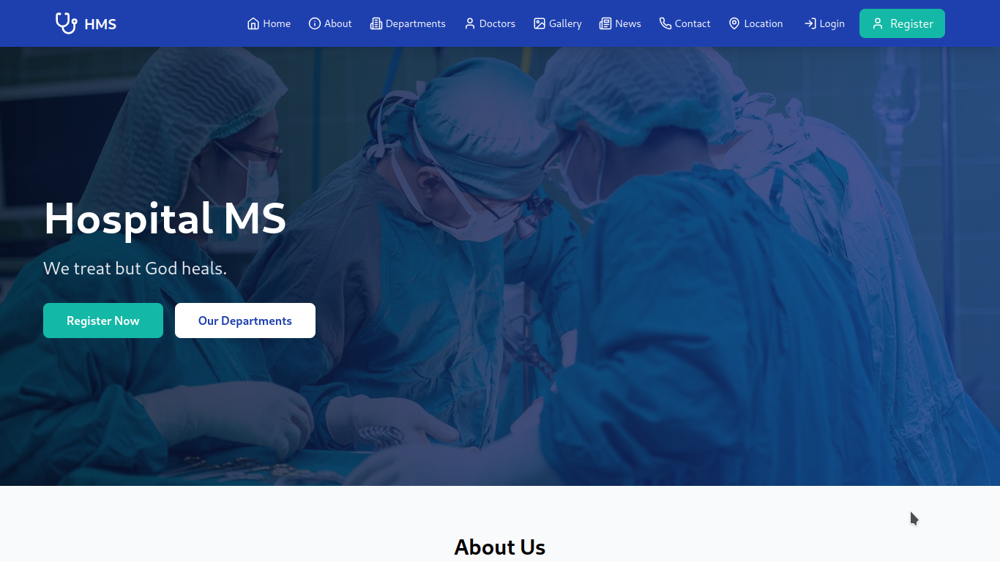
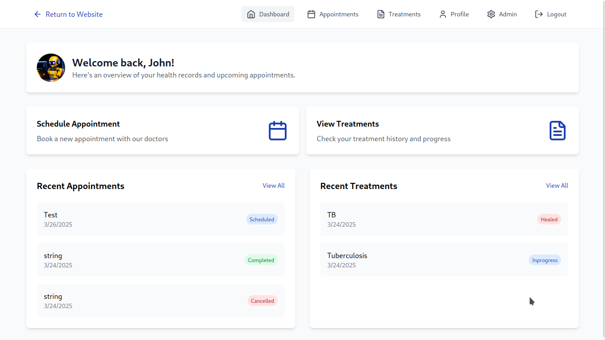

<h1 align="center">Hospital Management System  </h1>

A comprehensive system for appointment scheduling, patient record management, and a patient portal, all designed to improve healthcare efficiency.

| Identity | Screenshot |
|----------|-------------|
| Admin   |  |
| Index   |  |
| Dashboard |  |

## Technologies Used

- **Django** – Backend framework for handling database and authentication.
- **FastAPI** – High-performance API framework for seamless integration.
- **React** – Frontend framework for a modern and responsive user interface.

## Features

- **Appointment Scheduling** – Easily book and manage patient appointments.
- **Patient Record Management** – Securely store and retrieve patient information.
- **Patient Portal** – Allows patients to view their records and manage appointments.
- **Admin Dashboard** – Manage hospital operations effectively.
- **API Documentation** – Interactive API documentation with OpenAPI.

## Installation

Follow these steps to set up the project:

> [!NOTE]
> You need to have [Python>=3.13](https://python.org) and [Git](https://git-scm.com).

```sh
git clone https://github.com/Simatwa/hospital-management-system.git
cd hospital-management-system
pip install virtualenv # Incase it's not installed

# Create and activate virtual environment
virtualenv venv
source venv/bin/activate # *nix
.\venv\Scripts\activate # Windows


pip install -r requirements.txt

# Set up Django database
python manage.py makemigrations users hospital
python manage.py migrate
python manage.py collectstatic

# Create superuser
python manage.py createsuperuser --username developer --email developer@localhost.domain --noinput

# Run FastAPI
python -m fastapi run api
```

## Site Endpoints

- **Home Page**: `/`
- **API Documentation**: `/api/docs`
- **Redoc Documentation**: `/api/redoc`
- **Admin Panel**: `/d/admin`

> [!IMPORTANT]
> Admin username : `developer`.
> Password: `development`

## Acknowledgement

I acknowledge the members of my group, **Vanguard**, for their effort in partially financing this project and for being patient enough to see our cool idea turn into a reality.

## Dedication

I dearly dedicate this work to all hospitals in my ancestral continent, **Africa**, in a bid to push the narrative that access to quality health facilities should be universal—because indeed, it should.

## Collaboration

Contributions are always welcome! Feel free to fix any issues in the code or implement new features to improve the HMS. Fork the repository, make your changes, and submit a pull request. If it's a good one, I'll be sure to merge it!

## License

This project is licensed under the [MIT License](LICENSE).